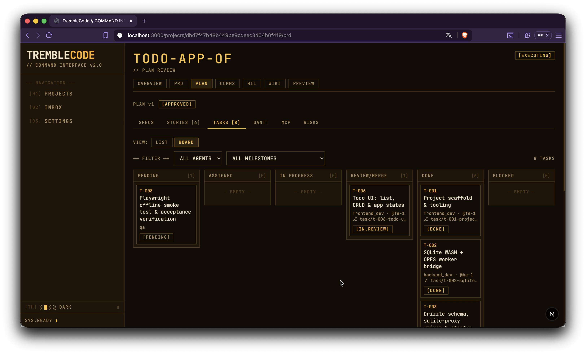
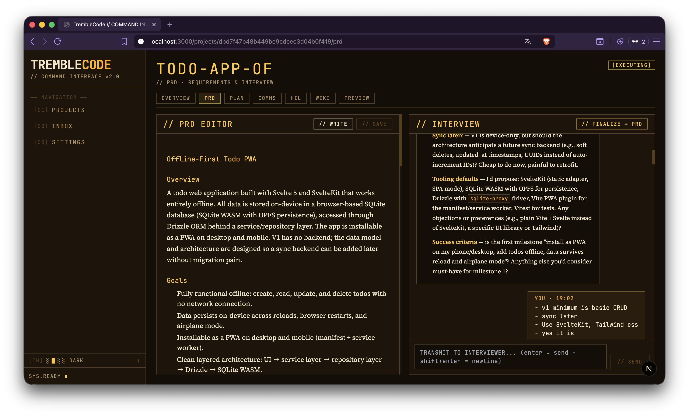
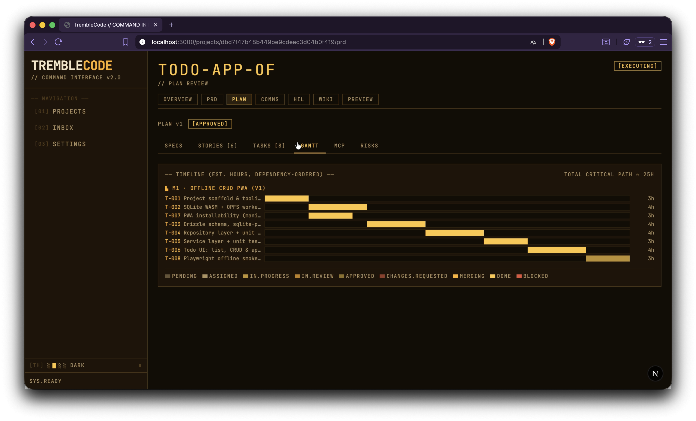
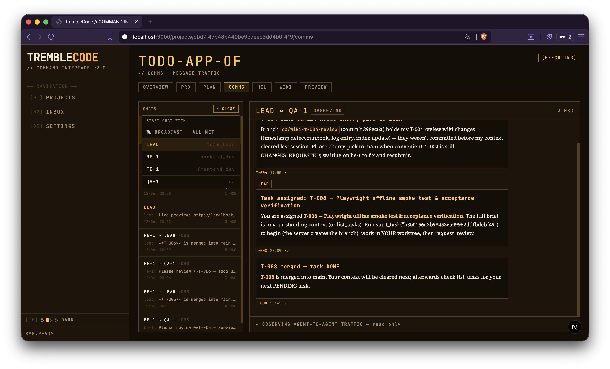
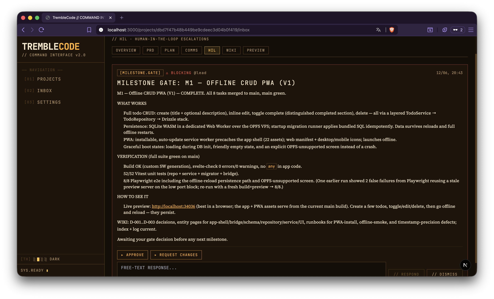
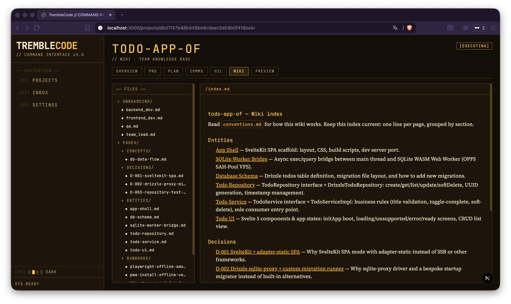
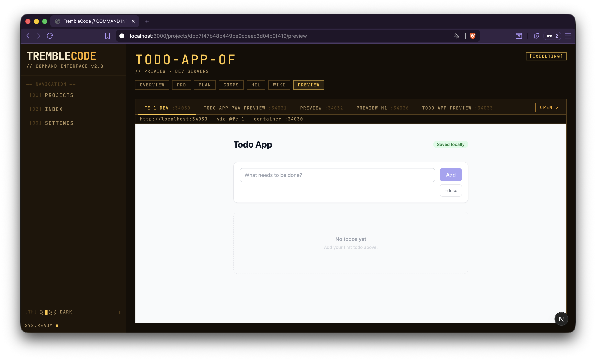

<div align="center">

# 🐝 TrembleCode

**The self-hosted software house.** Hand a PRD to a team of Claude Code agents
that plans, builds, reviews and ships — on your machines, on your Claude
subscription, with you in the loop only when it matters.

[](LICENSE)
[](https://github.com/tremblecode/tremblecode/actions/workflows/ci.yml)

</div>

<p align="center"></p>

> **Why "TrembleCode"?** When a forager honeybee finds more nectar than the hive
> can handle, it performs a _tremble dance_ — the signal to recruit more workers.
> That's the idea: describe the work, and the right team shows up to do it.

## What it does

1. **New project** → paste a PRD, or keep "start with discussion" and interview
   your way to one with a planning agent.
2. **Generate a plan** → the team lead explores the repo and proposes milestones,
   stories, tasks, and the MCP servers it wants.
3. **Review & approve** the plan in a 6-tab editor; tweak tasks inline.
4. **Watch it build.** A sandboxed team — team lead, backend/frontend devs, QA —
   claims tasks, writes code, reviews, and merges through a serialized queue.
   You only answer Inbox items (questions, destructive ops, milestone gates).
5. **See everything live:** the board, the comms feed, each agent's terminal,
   the project wiki, dev-server previews, and per-agent/day/model cost tracking.

## Screenshots

<table>
  <tr>
    <td width="50%"><a href="docs/assets/prd_discussion.png"></a><br><sub><b>PRD discussion</b> — interview a planning agent until you have a spec.</sub></td>
    <td width="50%"><a href="docs/assets/gantt.png"></a><br><sub><b>Plan review</b> — milestones, stories, tasks, MCP, and a critical-path Gantt.</sub></td>
  </tr>
  <tr>
    <td width="50%"><a href="docs/assets/task_board.png"></a><br><sub><b>Task board</b> — the team claims and moves tasks through the queue.</sub></td>
    <td width="50%"><a href="docs/assets/communications.png"></a><br><sub><b>Comms feed</b> — the agent-to-agent message bus, in real time.</sub></td>
  </tr>
  <tr>
    <td width="50%"><a href="docs/assets/hil.png"></a><br><sub><b>Human-in-the-loop</b> — milestone gates and escalations land in your Inbox.</sub></td>
    <td width="50%"><a href="docs/assets/wiki.png"></a><br><sub><b>Project wiki</b> — the agent-maintained, git-versioned knowledge base.</sub></td>
  </tr>
  <tr>
    <td width="50%"><a href="docs/assets/preview.png"></a><br><sub><b>Preview</b> — live dev-server previews per agent, in the dashboard.</sub></td>
    <td width="50%"></td>
  </tr>
</table>

## Why TrembleCode

- **Self-hosted and glass-box.** Your code never leaves your infrastructure, and
  you can watch every agent's terminal in real time. Not a cloud black box.
- **Your Claude subscription, no markup.** Bring your own Claude login (or an
  Anthropic API key). You pay Anthropic's price for inference — there's no
  per-seat AI tax on top.
- **A whole SDLC, not a single coding agent.** PRD → plan → a role-based team →
  review → QA → merge queue → project-wiki memory — coordinated, not one bot in
  a loop.
- **Human-in-the-loop only on hot topics.** Conservative escalation defaults
  send destructive ops and ambiguous calls to your Inbox; everything else is
  autonomous.

## Quickstart

Prerequisites: Docker Desktop, Node 22 + pnpm, Python 3.12 + [uv](https://docs.astral.sh/uv/),
and a Claude subscription (recommended) or Anthropic API key.

```bash
docker compose up -d redis      # infra
make image                      # build the sandbox image (once)
make image-flutter              # optional, for Flutter projects

cd server && uv sync && cd ..
cd web && pnpm install && cd ..

make dev                        # server :8400 + web :3000
```

First run only: create a project, start it, open the team-lead terminal in the
dashboard (team card → RW toggle) and run `/login`. The login persists in
`~/.tremblecode/agent-home` across all projects and restarts. Prefer API-key
mode? Set it in Settings instead.

> ⚠️ There's no built-in authentication yet — keep the server on localhost or
> behind a VPN/reverse proxy. See [SECURITY.md](SECURITY.md).

## Architecture

```
web (Next.js :3000) ──► server (FastAPI :8400) ──► SQLite + Redis + Docker
                                                      │
                            one container per project ▼  (tc-<slug>)
                            relay (hooks, Redis consumers, tmux manager)
                            tmux: tc-lead / tc-be-1 / tc-fe-1 / tc-qa-1 …
                            each pane = interactive Claude Code session
                            + per-agent "tremblecode" MCP server (comms/tasks)
```

- **Comms**: a message bus (SQLite truth + Redis streams with consumer groups and
  explicit ACKs). Agents get a one-line tmux notification and pull bodies via MCP
  `check_messages` / confirm with `ack_message`. Humans ride the same bus.
- **Workflow**: PENDING → ASSIGNED → IN_PROGRESS → IN_REVIEW → APPROVED →
  MERGING → DONE, with CAS claims, dependency gating, least-loaded QA routing,
  and a server-serialized merge queue (the lead is the only merger).
- **Memory**: each project keeps an agent-maintained markdown wiki (Karpathy's like) (`repo/.wiki/`
  — index/log/pages), git-versioned; agents ingest after every task, query
  index-first, and lint at every milestone.
- **Context policy**: `/clear` after every task; standing context (task brief,
  roster, wiki pointer, pending messages) is re-injected on every SessionStart
  hook, so context loss is always safe.
- **Sandbox**: project dirs are identity-mounted (same absolute path inside the
  container) so git worktrees stay valid; a 10-port block per project exposes dev
  servers to the host and the dashboard preview tab.

### Layout

```
server/    FastAPI orchestrator (API, docker/git provisioning, merge queue,
           watchdog, terminal bridge, costs)
web/       Next.js dashboard (TUI theme, plan review, board, comms, inbox,
           web terminals, wiki browser, preview)
sandbox/   container image + in-container runtime (relay, MCP server, hooks)
templates/ role prompts, CLAUDE.md/identity/hooks/mcp templates, wiki
           skeleton, MCP catalog
```

## Tests

```bash
make test          # server suite (workflow, provisioning, costs, mcp, wiki)
cd web && pnpm build
```

## Sustainability

TrembleCode is **AGPL-3.0 and free to self-host, forever** — individuals and
single teams will never hit a paywall. To fund development, we plan to eventually
offer a managed cloud and enterprise support for organizational needs (SSO,
multi-user, SLAs). **There's nothing to buy today.**

The AGPL covers TrembleCode itself, not your work: code your agents write for you
is yours, and running TrembleCode as a tool doesn't impose AGPL obligations on
the projects it builds.

## Community & contributing

- 💬 [Discussions](https://github.com/tremblecode/tremblecode/discussions) — questions, setups, ideas
- 🗺️ [Roadmap](docs/roadmap.md)
- 🤝 [Contributing guide](CONTRIBUTING.md) · [Code of Conduct](CODE_OF_CONDUCT.md)
- 🔒 [Security policy](SECURITY.md)

## License

[GNU AGPL-3.0-only](LICENSE) © TrembleCode contributors.
